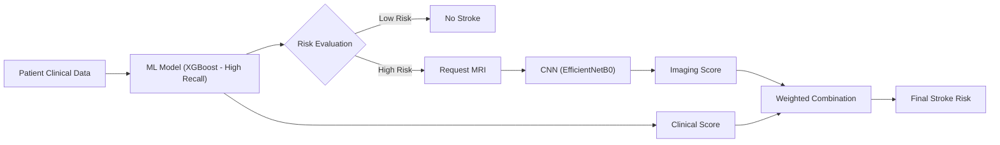
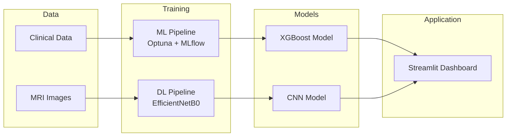
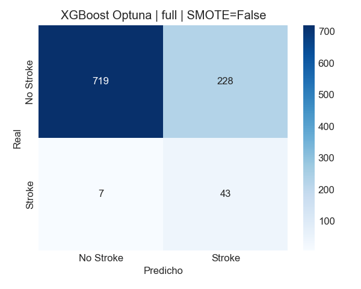
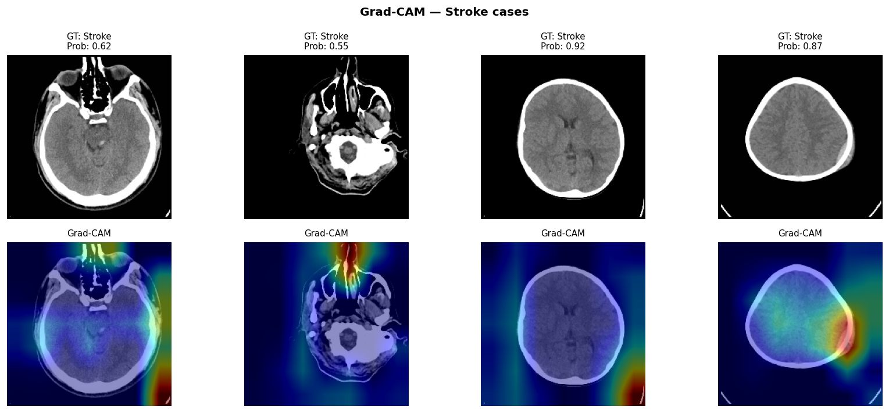

# 🧠 Stroke Prediction AI System (ML + DL Hybrid)

    

---

## 🚀 Overview

This project is a **hybrid AI system** for stroke prediction combining:

* 🧮 Machine Learning (tabular clinical data)
* 🧠 Deep Learning (MRI classification with CNN + EfficientNetB0)
* 📊 MLflow experiment tracking
* ⚙️ Optuna hyperparameter optimization
* 🌐 Streamlit clinical dashboard

The system is designed to simulate a **real-world clinical triage pipeline**, prioritizing **recall over precision** due to the critical nature of stroke detection.

---

## 🚑 Why This Matters

Stroke is a **time-critical condition** where missing a positive case can have severe consequences.

👉 This system is designed to:

* Maximize **early detection (high recall)**
* Reduce **false positives using imaging validation**
* Mimic **real clinical decision workflows**

---

## 🧠 Hybrid Decision Pipeline




### 💡 Key Idea

This system follows a **sequential hybrid approach**:

* First, a **high-recall ML model** detects potential stroke cases
* Then, a **CNN refines predictions using MRI**
* Finally, both predictions are **combined using AUC-based weighting**

---

## 🏗️ System Architecture



The system is structured in 4 layers:

* Data Layer → raw datasets
* Training Layer → ML + DL pipelines
* Model Layer → trained models
* Application Layer → clinical dashboard

> This modular design ensures scalability and separation of concerns


## 🎯 Key Results

| Model               | AUC      | F1 Score | Recall   |
| ------------------- | -------- | -------- | -------- |
| Logistic Regression | 0.84     | 0.72     | 0.78     |
| Random Forest       | 0.86     | 0.75     | 0.80     |
| 🏆 XGBoost (Optuna) | **0.89** | **0.78** | **0.83** |

> ✅ Optimized for **recall** (minimizing false negatives in stroke detection)

---

## 🧠 CNN Performance

| Model          | AUC        | Recall | Precision  | F1         |
| -------------- | ---------- | ------ | ---------- | ---------- |
| Baseline CNN   | 0.9537     | 0.9720 | 0.6651     | 0.7898     |
| EfficientNetB0 | **0.9618** | 0.9021 | **0.8269** | **0.8629** |

---

## ⚖️ Model Combination Strategy

Final prediction is computed as a weighted combination:

```
Final Risk = (XGBoost × 0.40) + (CNN × 0.60)
```

Weights are based on **model performance (AUC)**:

- XGBoost → early detection (high recall)  
- CNN → image-based validation (high precision)  
- CNN has higher weight due to stronger diagnostic reliability  

> This balances **sensitivity and specificity**, critical in clinical settings.

---

## 🏥 Clinical Perspective

The system mimics a real-world diagnostic workflow:

1. **Initial screening** using clinical variables
2. **Secondary validation** using medical imaging
3. **Risk scoring** to support medical decisions

> Designed to assist—not replace—clinical judgment.

---

## 🖼️ Model Insights

### 📊 Confusion Matrix (Best Model)

<p align="center">
  
</p>

This matrix evaluates model performance with a strong focus on minimizing **false negatives**, which are critical in stroke prediction.

### 🔥 CNN Interpretability (Grad-CAM)

<p align="center">
  
</p>

Grad-CAM visualizes which regions of the MRI influenced the CNN decision, improving interpretability and trust in medical predictions.

---

## 🧪 Testing & Quality

Run tests:

```bash
pytest --cov=src --cov-report=html
```

👉 Includes:

* data validation
* feature engineering checks
* model pipeline tests

---

## 🌐 Deployment

https://project-8-equipo1-datascientist.onrender.com/

---

## 🎥 Demo (Clinical Dashboard)


Interactive interface for:

* Patient data input
* MRI upload (on-demand)
* Risk scoring & recommendations

---

## ⚙️ Tech Stack

* **ML:** Scikit-learn, XGBoost, Optuna
* **DL:** TensorFlow / Keras (CNN, EfficientNet)
* **MLOps:** MLflow, Docker, GitHub Actions
* **Data:** Pandas, NumPy
* **Visualization:** Matplotlib, Seaborn

---

## 📁 Project Structure

```
Stroker_project/
├── app/                # API (deployment ready)
├── src/                # ML pipeline (modular)
├── cnn/                # Deep learning pipeline
├── models/             # Trained models
├── data/               # Datasets
├── notebooks/          # Experiments & EDA
├── assets/             # Visual results
├── test/               # Unit tests
├── mlruns/             # MLflow tracking
```
---


## 🧪 How to Run

```bash
# Clone repo
git clone https://github.com/your-username/stroke-prediction-ai.git
cd stroke-prediction-ai

# Install dependencies
pip install -r requirements.txt

# Run pipeline
python main.py

# Run API
python app/app.py

# Run tests
pytest
```

---

## 📊 Experiment Tracking

Using **MLflow**, all experiments tracked with:

* metrics: AUC, F1, recall, precision
* parameters: Optuna + model configs
* artifacts: confusion matrices, ROC curves

---

## 🔬 Features

✔ End-to-end ML pipeline
✔ Hyperparameter tuning (Optuna)
✔ Class imbalance handling (SMOTE)
✔ Model explainability (Grad-CAM)
✔ CI/CD integration
✔ Deployment-ready structure

---

## 👨‍💻 Team

**AI & Data Science Project** focused on real-world, production-ready machine learning systems.

| Name         | Role          |
| ------------ | ------------- |
| **Jonathan** | Scrum Master  |
| **Iris**     | Product Owner |
| **Gema**     | Developer     |

---

## ⭐ If you like this project...

Give it a star ⭐ and feel free to contribute!
